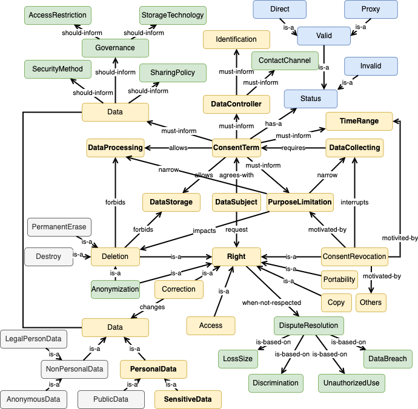
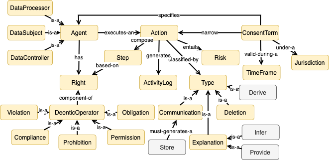

# Consent Ontology

Consent Ontology joins the PrOnto and GConsent ontologies and offers an extension inserting new entities and relationships to cover the identified gaps. Moreover, PrOnto and Gconsent are based on the GDPR, i.e., the same data protection regulation, which could be considered a limitation regarding applicability in other jurisdictions. In this sense, the extension proposed considered the Brazilian Data Protection Law (Law n. 13,709/2018 - Lei Geral de Proteção de Dados Pessoais - LGPD). 

This extension proposes three modules to mitigate the data flow informational asymmetry, as depicted in the figure below. 
The ConsentTerm module determines the consent legal basis requirements, and it narrows the data subject, controller, and processor actions. 
The Action defines the step execution based on the ConsentTerm to accomplished a specific action considering: 
    (i) the jurisdiction, to allow the scenario contextualization; 
    (ii) consent term which the action is based on; 
    (iii) time frame, 
    (iv) rights based on the jurisdiction applied, and
    (v) the deontic operator to indicate a normative expression.
Moreover, the Action generates a log of executed actions, and it should explain the action performed. Still, this can be used as evidence to evaluate the consent term compliance. 

Fig.1 - ConsentOntology Structure.

The LGPD cases can present intersections with other laws in the Brazilian constitution, depending on the case, as depicted in the figure below. 

LGPD defines: 
 - legal basis: consent is the most popular, but there are others foreseen in the law, 
 - data protection guidelines: general guidelines, 
 - applicability: there are some situations that the LGPD cannot be applied, such as when the data is anonymized,
 - concepts: LGPD qualifies personal data, sensitive personal data, data controller, among others,
 - rights and duties: LGPD sets rights and duties for data subjects, controllers and processors.

Fig.2 - LGPD Structure.

In a detailed view, the next figure depicts the relationships between the ontology entities, and it is important to note that the "consent term" and the "right" are the central ontology points; they have many connections with other concepts as well as the entity "dispute resolution". For instance, if the purpose limitation changes, the data controller must get a new consent term from the data subject. Hence, depending on the data subject will, he/she can disagree, and it will interrupt the data collection. Still, if the data controller does not stop collecting the data subject's personal data, it will violate its rights, and fines will be applied to the data controller.

Even though the LGPD did not specify the data processing modalities, we decided to insert information regarding data security, access restriction, technologies applied, and sharing politics. These pieces of information are important to understand the environmental factors related to the scenario execution and explanation. 

Furthermore, there are 10 (ten) legal bases foreseen in the LGPD and we decided to start our study on Consent legal basis. We decided to use consent as a study object because it can be applied in most situations.

Fig.3 - ConsentOntology Relationships.

The yellow entities are those that are present in the PrOnto ontology that fits the LGPD consent legal basis.
The blue entities are those inherited from GConsent ontology.
The green entities are those which were added to fulfill the LGPD needs; however, these entities can be also applied in scenarios ruled by the GDPR without producing inconsistencies or conflicts with the remain entities.
The gray entities are those that the LGPD does not consider specifically as a concern.

## Scenario Structure

This scenario structure was developed based on the ConsentOntology. Our scenario presents five pillars: Agent, Action, Consent Term, Right, and DeonticOperator , which will be detailed and depicted below:
 - **Agent**: Scenarios have to define the agents, i.e., who are the Data Subjects, Data Controllers and Data Processors that will be involved and their actions.
 - **Action**: The actions are narrowed by the consent term, which defines the agents, the purpose, the data that will be used, and the time frame. Moreover, the actions are executed under a jurisdiction and entail risks, such as the risk of a data leak. Last but not least, actions are composed of steps, which are executed based on the current rights available for the agents and persisted by log registries. Moreover, the Action can be classified by types, which will help the explanation process filtering the activity log.
 - **Consent Term**: As the study object, the consent term has an important role in defining all required information to let the data subject be aware of data sharing conditions, narrow the data controller actions and context of use the data subjects information.
 - **Right**: The agents may have different rights depending on the classification, time frame and previous actions. The rights are complemented by the Deontic Operators.
 - **Deontic Operator**: The deontic concepts defines if there is an obligation, prohibition, and permission. Furthermore, PrOnto includes violation and compliance as status related to an obligation or prohibition as well.
 
All actions are persisted in an **activity log** to be used as a explanation evidence. The logs are composed of: 

<ol type="i">
  <li>action description;</li>
  <li>action type;</li>
  <li>deontic operator;</li>
  <li>action timestamp.</li>
</ol>

Fig.4 - Scenario Structure - Action Module.

For more details, we are planning to publish our work, meanwhile you can contact me.