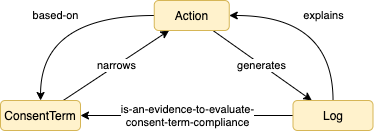

# Consent Ontology

Consent Ontology joins the PrOnto and GConsent ontologies and offers an extension inserting new entities and relationships to cover the identified gaps. Moreover, PrOnto and Gconsent are based on the GDPR, i.e., the same data protection regulation, which could be considered a limitation regarding applicability in other jurisdictions. In this sense, the extension proposed considered the Brazilian Data Protection Law (Law n. 13,709/2018 - Lei Geral de Proteção de Dados Pessoais - LGPD). 

This extension proposes three modules to mitigate the data flow informational asymmetry, as depicted in the figure below. 
The ConsentTerm module determines the consent legal basis requirements, and it narrows the data subject, controller, and processor actions. 
The Action defines the step execution based on the ConsentTerm to accomplished a specific action considering: 
    (i) the jurisdiction, to allow the scenario contextualization; 
    (ii) consent term which the action is based on; 
    (iii) time frame, 
    (iv) rights based on the jurisdiction applied, and
    (v) the deontic operator to indicate a normative expression.
Moreover, the Action generates a log of executed actions, and it should explain the action performed. Still, this can be used as evidence to evaluate the consent term compliance. 

For more details, we are planning to publish our work, meanwhile you can contact me.